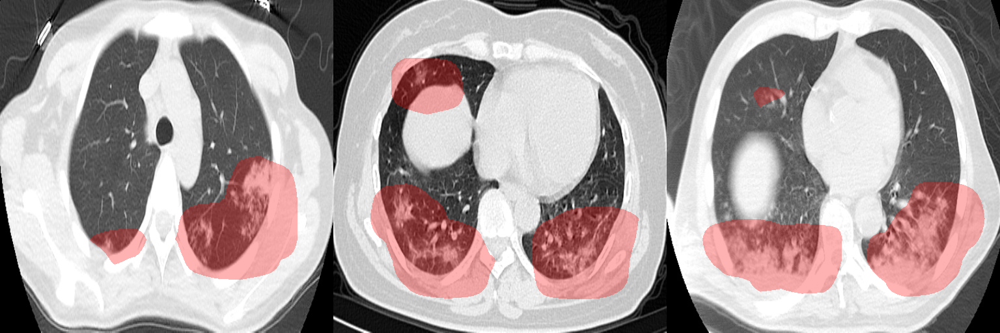
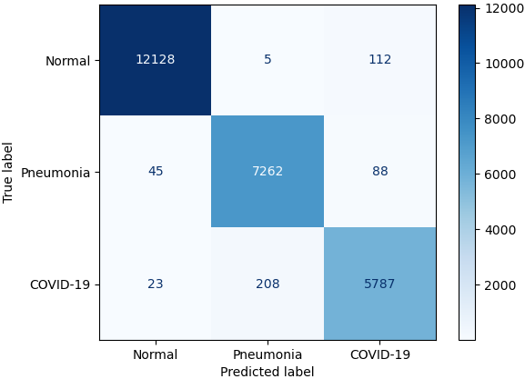
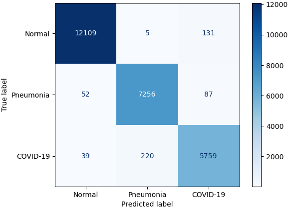

# COVID-Net Open Source Initiative - COVID-Net CT

**Note: The COVID-Net CT models provided here [as part of the COVID-Net Initiative](http://www.covid-net.ml) are intended to be used as reference models that can be built upon and enhanced as new data becomes available. They are currently at a research stage and not yet intended as production-ready models (i.e., not meant for direct clinical diagnosis), and we are working continuously to improve them as new data becomes available. Please do not use COVID-Net CT for self-diagnosis and seek help from your local health authorities.**

**Update 2022-06-02:** We released the [COVIDx CT-3A and CT-3B](https://www.kaggle.com/datasets/hgunraj/covidxct) datasets on Kaggle, comprising 425,024 CT slices from 5,312 patients and 431,205 CT slices from 6,068 patients, respectively. The data is described in [this preprint](https://arxiv.org/abs/2206.03043).\
**Update 2022-03-10:** The [COVID-Net CT-2 paper](https://www.frontiersin.org/articles/10.3389/fmed.2021.729287) was published in _Frontiers in Medicine_.\
**Update 2021-01-26:** We released the [COVID-Net CT-2 models](docs/models.md) and [COVIDx CT-2A and CT-2B](https://www.kaggle.com/datasets/c395fb339f210700ba392d81bf200f766418238c2734e5237b5dd0b6fc724fcb/version/4) datasets, comprising 194,922 CT slices from 3,745 patients and 201,103 CT slices from 4,501 patients, respectively.\
**Update 2020-12-23:** The [COVID-Net CT-1 paper](https://www.frontiersin.org/articles/10.3389/fmed.2020.608525) was published in _Frontiers in Medicine_.\
**Update 2020-12-03:** We released the [COVIDx CT-1](https://www.kaggle.com/dataset/c395fb339f210700ba392d81bf200f766418238c2734e5237b5dd0b6fc724fcb/version/1) dataset on Kaggle.\
**Update 2020-09-13:** We released a preprint of the [COVID-Net CT paper](https://arxiv.org/abs/2009.05383).

<p align="center">
	
	<br>
	<em>Example CT scans of COVID-19 cases and their associated critical factors (highlighted in red) as identified by GSInquire.</em>
</p>

The coronavirus disease 2019 (COVID-19) pandemic continues to have a tremendous impact on patients and healthcare systems around the world. In the fight against this novel disease, there is a pressing need for rapid and effective screening tools to identify patients infected with COVID-19, and to this end CT imaging has been proposed as one of the key screening methods which may be used as a complement to RT-PCR testing, particularly in situations where patients undergo routine CT scans for non-COVID-19 related reasons, patients have worsening respiratory status or developing complications that require expedited care, or patients are suspected to be COVID-19-positive but have negative RT-PCR test results. Early studies on CT-based screening have reported abnormalities in chest CT images which are characteristic of COVID-19 infection, but these abnormalities may be difficult to distinguish from abnormalities caused by other lung conditions. Motivated by this, in this study we introduce COVID-Net CT, a deep convolutional neural network architecture that is tailored for detection of COVID-19 cases from chest CT images via a machine-driven design exploration approach. Additionally, we introduce COVIDx CT, a benchmark CT image dataset derived from a variety of sources of CT imaging data currently comprising 201,103 images across 4,501 patient cases. Furthermore, in the interest of reliability and transparency, we leverage an explainability-driven performance validation strategy to investigate the decision-making behaviour of COVID-Net CT, and in doing so ensure that COVID-Net CT makes predictions based on relevant indicators in CT images. Both COVID-Net CT and the COVIDx CT dataset are available to the general public in an open-source and open access manner as part of the [COVID-Net Initiative](http://www.covid-net.ml). While COVID-Net CT is **not yet a production-ready screening solution**, we hope that releasing the model and dataset will encourage researchers, clinicians, and citizen data scientists alike to leverage and build upon them.

For a detailed description of the methodology behind COVID-Net CT and a full description of the COVIDx CT dataset, please read the [COVID-Net CT-1](https://www.frontiersin.org/articles/10.3389/fmed.2020.608525) and [COVID-Net CT-2](https://arxiv.org/abs/2101.07433) papers.

This work is made possible by a number of publicly available CT data sources. Licenses and acknowledgements for these datasets can be found [here](docs/licenses_acknowledgements.md).

Our desire is to encourage broad adoption and contribution to this project. Accordingly this project has been licensed under the GNU Affero General Public License 3.0. Please see [license file](LICENSE.md) for terms. If you would like to discuss alternative licensing models, please reach out to us at hayden.gunraj@uwaterloo.com and a28wong@uwaterloo.ca.

For COVID-Net CXR models and the COVIDx dataset for COVID-19 detection and severity assessment from chest X-ray images, please go to the [main COVID-Net repository](https://github.com/lindawangg/COVID-Net).

If you are a researcher or healthcare worker and you would like access to the **GSInquire tool to use to interpret COVID-Net CT results** on your data or existing data, please reach out to a28wong@uwaterloo.ca or alex@darwinai.ca.

If there are any technical questions after the README, FAQ, and past/current issues have been read, please post an issue or contact hayden.gunraj@uwaterloo.com

If you find our work useful for your research, please cite:

```
@article{Gunraj2020,
  author={Gunraj, Hayden and Wang, Linda and Wong, Alexander},
  title={COVIDNet-CT: A Tailored Deep Convolutional Neural Network Design for Detection of COVID-19 Cases From Chest CT Images},
  journal={Frontiers in Medicine},
  volume={7},
  pages={1025},
  year={2020},
  url={https://www.frontiersin.org/article/10.3389/fmed.2020.608525},
  doi={10.3389/fmed.2020.608525},
  issn={2296-858X}
}
```

```
@article{Gunraj2022,
  author={Gunraj, Hayden and Sabri, Ali and Koff, David and Wong, Alexander},
  title={COVID-Net CT-2: Enhanced Deep Neural Networks for Detection of COVID-19 From Chest CT Images Through Bigger, More Diverse Learning},
  journal={Frontiers in Medicine},
  volume={8},
  pages={729287},
  year={2022},
  url={https://www.frontiersin.org/articles/10.3389/fmed.2021.729287},
  doi={10.3389/fmed.2021.729287},
  issn={2296-858X}
}
```

## Core COVID-Net Team
* DarwinAI Corp., Canada and Vision and Image Processing Lab, University of Waterloo, Canada
  * Linda Wang
  * Alexander Wong
  * Zhong Qiu Lin
  * Paul McInnis
  * Audrey Chung
  * Melissa Rinch
  * Jeffer Peng
* Vision and Image Processing Lab, University of Waterloo, Canada
  * James Lee
  * Hossein Aboutalebi
  * Alex MacLean
  * Saad Abbasi
  * Hayden Gunraj
  * Maya Pavlova
  * Naomi Terhljan
  * Siddharth Surana
  * Andy Zhao
* Ashkan Ebadi and Pengcheng Xi (National Research Council Canada)
* Kim-Ann Git (Selayang Hospital)
* Abdul Al-Haimi, [COVID-19 ShuffleNet Chest X-Ray Model](https://github.com/aalhaimi/covid-net-cxr-shuffle)
* Dr. Ali Sabri (Department of Radiology, Niagara Health, McMaster University, Canada)

## Table of Contents
1. [Requirements to install on your system](#requirements)
2. [How to download and prepare the COVIDx CT dataset](docs/dataset.md)
3. [Steps for training, evaluation and inference](docs/train_eval_inference.md)
4. [Results](#results)
5. [Links to pretrained models](docs/models.md)
6. [Licenses and acknowledgements for the datasets used](docs/licenses_acknowledgements.md)

## Requirements
The main requirements are listed below:

* Tested with Tensorflow 1.15
* OpenCV 4.2.0
* Python 3.7
* Numpy
* Scikit-Learn
* Matplotlib

## Results
These are the final test results for the current COVID-Net CT models on the COVIDx CT dataset.

### COVID-Net CT-2 L (3A)
<p>
	
	<br>
	<em>Confusion matrix for COVID-Net CT-2 L on the COVIDx CT-3A test dataset.</em>
</p>

<div class="tg-wrap"><table class="tg">
  <tr>
    <th class="tg-7btt" colspan="3">Sensitivity (%)</th>
  </tr>
  <tr>
    <td class="tg-7btt">Normal</td>
    <td class="tg-7btt">Pneumonia</td>
    <td class="tg-7btt">COVID-19</td>
  </tr>
  <tr>
    <td class="tg-c3ow">99.0</td>
    <td class="tg-c3ow">98.2</td>
    <td class="tg-c3ow">96.2</td>
  </tr>
</table></div>

<div class="tg-wrap"><table class="tg">
  <tr>
    <th class="tg-7btt" colspan="3">Positive Predictive Value (%)</th>
  </tr>
  <tr>
    <td class="tg-7btt">Normal</td>
    <td class="tg-7btt">Pneumonia</td>
    <td class="tg-7btt">COVID-19</td>
  </tr>
  <tr>
    <td class="tg-c3ow">99.4</td>
    <td class="tg-c3ow">97.2</td>
    <td class="tg-c3ow">96.7</td>
  </tr>
</table></div>

### COVID-Net CT-2 S (3A)
<p>
	
	<br>
	<em>Confusion matrix for COVID-Net CT-2 S on the COVIDx CT-3A test dataset.</em>
</p>

<div class="tg-wrap"><table class="tg">
  <tr>
    <th class="tg-7btt" colspan="3">Sensitivity (%)</th>
  </tr>
  <tr>
    <td class="tg-7btt">Normal</td>
    <td class="tg-7btt">Pneumonia</td>
    <td class="tg-7btt">COVID-19</td>
  </tr>
  <tr>
    <td class="tg-c3ow">98.9</td>
    <td class="tg-c3ow">98.1</td>
    <td class="tg-c3ow">95.7</td>
  </tr>
</table></div>

<div class="tg-wrap"><table class="tg">
  <tr>
    <th class="tg-7btt" colspan="3">Positive Predictive Value (%)</th>
  </tr>
  <tr>
    <td class="tg-7btt">Normal</td>
    <td class="tg-7btt">Pneumonia</td>
    <td class="tg-7btt">COVID-19</td>
  </tr>
  <tr>
    <td class="tg-c3ow">99.3</td>
    <td class="tg-c3ow">97.0</td>
    <td class="tg-c3ow">96.4</td>
  </tr>
</table></div>
