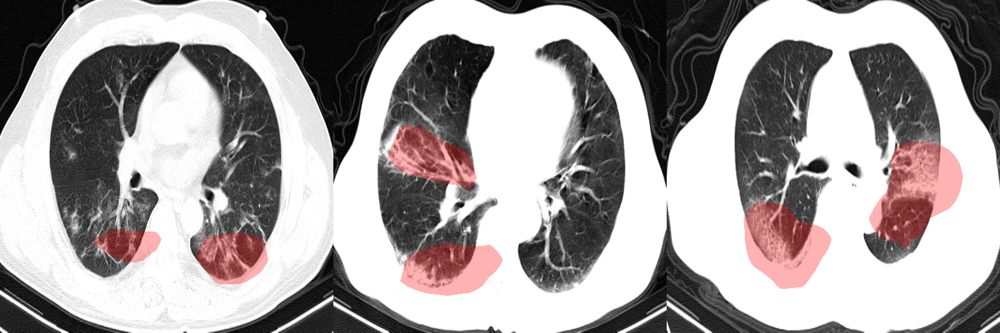
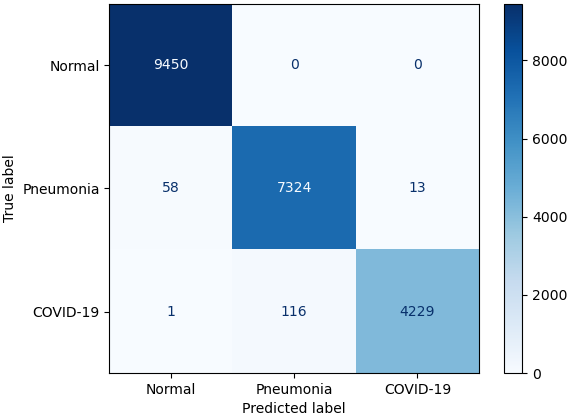
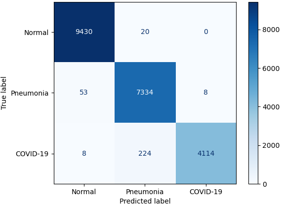

# COVID-Net Open Source Initiative - COVIDNet-CT

**Note: The COVIDNet-CT models provided here are intended to be used as reference models that can be built upon and enhanced as new data becomes available. They are currently at a research stage and not yet intended as production-ready models (not meant for direct clinical diagnosis), and we are working continuously to improve them as new data becomes available. Please do not use COVIDNet-CT for self-diagnosis and seek help from your local health authorities.**

	
	 
	<em>Example CT scans of COVID-19 cases and their associated critical factors (highlighted in red) as identified by GSInquire.</em>

Inspired by the open source efforts of the research community, we introduce COVIDNet-CT, a deep convolutional neural network design tailored for the detection of COVID-19 cases from chest CT images that is open source and available to the general public. COVIDNet-CT models were trained on COVIDx-CT, an open access benchmark dataset that we generated from open source datasets which is comprised of 104,009 CT images from 1,489 patients. Furthermore, we investigate how COVIDNet-CT makes predictions using an explainability method in an attempt to not only gain deeper insights into critical factors associated with COVID-19 cases, which can aid clinicians in improved screening, but also audit COVIDNet-CT in a responsible and transparent manner to validate that it is making decisions based on relevant information from the CT images. **By no means a production-ready solution**, the hope is that the open access COVIDNet-CT models, along with the description on constructing the dataset, will be leveraged and built upon by both researchers and citizen data scientists alike to accelerate the development of highly accurate yet practical deep learning solutions for detecting COVID-19 cases and accelerate treatment of those who need it the most.

Our desire is to encourage broad adoption and contribution to this project. Accordingly this project has been licensed under the GNU Affero General Public License 3.0. Please see [license file](LICENSE.md) for terms. If you would like to discuss alternative licensing models, please reach out to us at haydengunraj@gmail.com and a28wong@uwaterloo.ca or alex@darwinai.ca.

For COVIDNet-CXR models and the COVIDx dataset for COVID-19 detection and severity assessment from chest X-ray images, please go to the [main COVID-Net repository](https://github.com/lindawangg/COVID-Net).

If you are a researcher or healthcare worker and you would like access to the **GSInquire tool to use to interpret COVIDNet-CT results** on your data or existing data, please reach out to a28wong@uwaterloo.ca or alex@darwinai.ca.

If there are any technical questions after the README, FAQ, and past/current issues have been read, please post an issue or contact:
* haydengunraj@gmail.com
* linda.wang513@gmail.com
* jamesrenhoulee@gmail.com

## Core COVID-Net Team
* DarwinAI Corp., Canada and Vision and Image Processing Research Group, University of Waterloo, Canada
	* Linda Wang
	* Alexander Wong
	* Zhong Qiu Lin
	* James Lee
	* Paul McInnis
	* Audrey Chung
	* Hayden Gunraj, COVIDNet for CT
* Matt Ross and Blake VanBerlo (City of London), COVID-19 Chest X-Ray Model: https://github.com/aildnont/covid-cxr
* Ashkan Ebadi (National Research Council Canada)
* Kim-Ann Git (Selayang Hospital)
* Abdul Al-Haimi

## Table of Contents
1. [Requirements](#requirements) to install on your system
2. How to [download and prepare COVIDx-CT dataset](docs/dataset.md)
3. Steps for [training, evaluation and inference](docs/train_eval_inference.md)
4. [Results](#results)
5. [Links to pretrained models](docs/models.md)

## Requirements
The main requirements are listed below:

* Tested with Tensorflow 1.15
* OpenCV 4.2.0
* Python 3.7
* Numpy
* Scikit-Learn
* Matplotlib

## Results
These are the final test results for each COVIDNet-CT model on the COVIDx-CT dataset.

### COVIDNet-CT-A

	
	 
	<em>Confusion matrix for COVIDNet-CT-A on the COVIDx-CT test dataset.</em>

<table class="tg">
  <tr>
    <th class="tg-7btt" colspan="3">Sensitivity (%)</th>
  </tr>
  <tr>
    <td class="tg-7btt">Normal</td>
    <td class="tg-7btt">Pneumonia</td>
    <td class="tg-7btt">COVID-19</td>
  </tr>
  <tr>
    <td class="tg-c3ow">100</td>
    <td class="tg-c3ow">99.0</td>
    <td class="tg-c3ow">97.3</td>
  </tr>
</table>

<table class="tg">
  <tr>
    <th class="tg-7btt" colspan="3">Positive Predictive Value (%)</th>
  </tr>
  <tr>
    <td class="tg-7btt">Normal</td>
    <td class="tg-7btt">Pneumonia</td>
    <td class="tg-7btt">COVID-19</td>
  </tr>
  <tr>
    <td class="tg-c3ow">99.4</td>
    <td class="tg-c3ow">98.4</td>
    <td class="tg-c3ow">99.7</td>
  </tr>
</table>

### COVIDNet-CT-B

	
	 
	<em>Confusion matrix for COVIDNet-CT-B on the COVIDx-CT test dataset.</em>

<table class="tg">
  <tr>
    <th class="tg-7btt" colspan="3">Sensitivity (%)</th>
  </tr>
  <tr>
    <td class="tg-7btt">Normal</td>
    <td class="tg-7btt">Pneumonia</td>
    <td class="tg-7btt">COVID-19</td>
  </tr>
  <tr>
    <td class="tg-c3ow">99.8</td>
    <td class="tg-c3ow">99.2</td>
    <td class="tg-c3ow">94.7</td>
  </tr>
</table>

<table class="tg">
  <tr>
    <th class="tg-7btt" colspan="3">Positive Predictive Value (%)</th>
  </tr>
  <tr>
    <td class="tg-7btt">Normal</td>
    <td class="tg-7btt">Pneumonia</td>
    <td class="tg-7btt">COVID-19</td>
  </tr>
  <tr>
    <td class="tg-c3ow">99.4</td>
    <td class="tg-c3ow">96.8</td>
    <td class="tg-c3ow">99.8</td>
  </tr>
</table>

